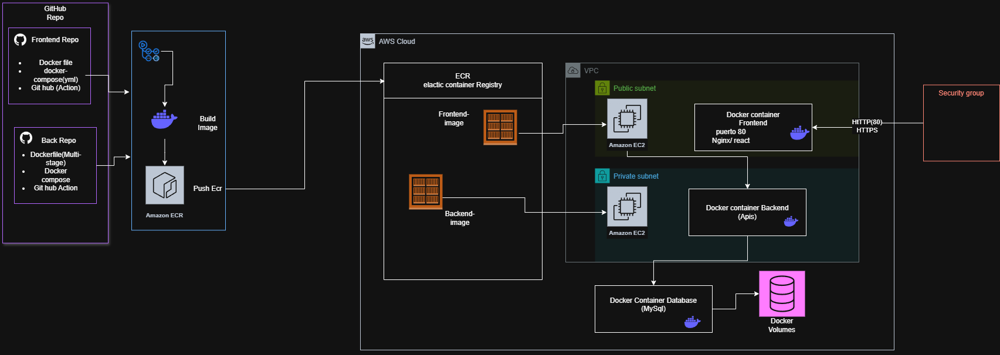

Prueba DevOps 2 - E-Commerce Deployment

Proyecto integral de desplegabilidad en AWS con microservicios Spring Boot, frontend React y orquestación con EKS (Kubernetes), ECR y Terraform.


## Componentes

### Backend Microservicios
- **Ventas API** (`back-Ventas_SpringBoot/`): Gestión de ventas y compras
- **Despachos API** (`back-Despachos_SpringBoot/`): Gestión de envíos
- Ambos en Spring Boot 3.4.4 con JPA y MySQL 8

### Frontend
- **React + Vite** (`front_despacho/`)
- Tailwind CSS
- Nginx como proxy inverso

### Base de Datos
- **MySQL 8** en EC2 pública
- Acceso restringido desde el clúster EKS


### Infraestructura (Terraform)
- VPC
- Subnets públicas y privadas
- EKS Cluster (Kubernetes)
- ECR
- NAT Gateway
- VPC Endpoints
- Security Groups

### Orquestación (Kubernetes)
- Deployments para Microservicios y Frontend
- Services (ClusterIP/LoadBalancer)
- ConfigMaps para variables de entorno

---

## Arquitectura del Proyecto

A continuación se muestra el diagrama de la arquitectura desplegada en AWS, incluyendo el flujo desde los repositorios, la construcción y almacenamiento de imágenes en ECR, y el despliegue en EKS/Kubernetes:



---

# Despliegue Rápido

## Prerequisitos

- AWS CLI configurado
- Terraform >= 1.0
- Docker Desktop
- Node.js 20+

---

## 1. Clonar Repositorio

```bash
git clone <repo-url>
cd Prueba_DevOps_2
```

---

## 2. Configurar AWS CLI

```bash
aws configure
```

Ingresar:
- Access Key
- Secret Key
- Region: `us-east-1`
- Output format: `json`

---

## 3. Desplegar Infraestructura

```bash
cd infra/terraform

terraform plan

terraform apply -auto-approve
```

---

## 4. Obtener DNS del Frontend

```bash
aws elbv2 describe-load-balancers \
  --region us-east-1 \
  --query 'LoadBalancers[?LoadBalancerName==`prueba_devops_2-frontend-alb`].DNSName' \
  --output text
```

---

# CI/CD Pipeline

## Flujo

```text
develop/main
      ↓
GitHub Actions
      ↓
Build & Test
      ↓
Docker Build
      ↓
Push ECR
      ↓
Terraform Apply
      ↓
EKS Deploy
```

> Nota: El workflow activo para despliegue es `.github/workflows/cd.yml` (EKS). El archivo `.github/workflows/cd.deploy.yml` se conserva solo como referencia.

---

## Secrets GitHub

```text
AWS_ACCESS_KEY_ID
AWS_SECRET_ACCESS_KEY
AWS_REGION
ECR_REGISTRY
MYSQL_ROOT_PASSWORD
MYSQL_DATABASE
```

---

# Variables Terraform

Archivo:

```text
infra/terraform/terraform.tfvars
```

Contenido:

```hcl
aws_region    = "us-east-1"
project_name  = "prueba_devops_2"
key_pair_name = "prueba_2"
```

---

# Acceso a Servicios

| Servicio | Acceso |
|----------|---------|
| Frontend | ALB DNS |
| Ventas API | http://ALB:8080/swagger-ui |
| Despachos API | http://ALB:8080/swagger-ui |
| MySQL | EC2-IP:3306 |

---

# Docker Build Manual

## Login ECR

```bash
aws ecr get-login-password --region us-east-1 | \
docker login --username AWS --password-stdin 348374603543.dkr.ecr.us-east-1.amazonaws.com
```

---

## Backend Ventas

```bash
cd back-Ventas_SpringBoot/Springboot-API-REST

docker build -t 348374603543.dkr.ecr.us-east-1.amazonaws.com/prueba_devops_2-ventas-back:latest .

docker push 348374603543.dkr.ecr.us-east-1.amazonaws.com/prueba_devops_2-ventas-back:latest
```

---

## Backend Despachos

```bash
cd ../../back-Despachos_SpringBoot/Springboot-API-REST-DESPACHO

docker build -t 348374603543.dkr.ecr.us-east-1.amazonaws.com/prueba_devops_2-despachos-back:latest .

docker push 348374603543.dkr.ecr.us-east-1.amazonaws.com/prueba_devops_2-despachos-back:latest
```

---

## Frontend

```bash
cd ../../front_despacho

npm install

npm run build

docker build -t 348374603543.dkr.ecr.us-east-1.amazonaws.com/prueba_devops_2-frontend:latest .

docker push 348374603543.dkr.ecr.us-east-1.amazonaws.com/prueba_devops_2-frontend:latest
```

---

# Forzar Redeploy ECS (referencia archivada, este proyecto usa EKS)

```bash
$cluster = "arn:aws:ecs:us-east-1:348374603543:cluster/prueba_devops_2-ecs-cluster"

aws ecs update-service --cluster $cluster \
  --service ventas-back-service \
  --force-new-deployment --region us-east-1

aws ecs update-service --cluster $cluster \
  --service despachos-back-service \
  --force-new-deployment --region us-east-1

aws ecs update-service --cluster $cluster \
  --service frontend-service \
  --force-new-deployment --region us-east-1
```

---

## Ver imágenes ECR

```bash
aws ecr list-images \
  --repository-name prueba_devops_2-ventas-back \
  --region us-east-1
```

---

# Estructura del Proyecto

```text
Prueba_DevOps_2/
├── .github/
│   └── workflows/
│       ├── ci.backend.yml
│       └── cd.deploy.yml
├── infra/
├── k8s/
├── back-Ventas_SpringBoot/
├── back-Despachos_SpringBoot/
├── front_despacho/
├── docker-compose.yml
└── README.md
```

---